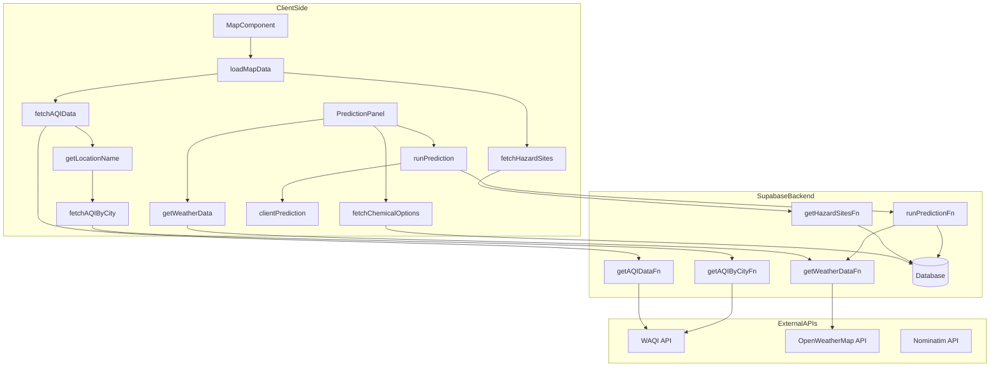

# EnviroSight - Hazard Map & Prediction

EnviroSight is a web application designed to visualize environmental data, including potential hazard sites and real-time Air Quality Index (AQI) stations. It also features a predictive modeling component to simulate the dispersion of selected chemical hazards based on current weather conditions at a chosen location.

 <!-- Replace with an actual screenshot -->

https://github.com/user-attachments/assets/88f51d83-548a-49a1-9c55-9fe9e502bdba

## Table of Contents

- [EnviroSight - Hazard Map \& Prediction](#envirosight---hazard-map--prediction)
  - [Table of Contents](#table-of-contents)
  - [Features](#features)
  - [Architecture](#architecture)
  - [Prerequisites](#prerequisites)
  - [Setup](#setup)
    - [1. Backend Setup (Supabase Edge Functions)](#1-backend-setup-supabase-edge-functions)
    - [2. Frontend Setup (This Repository)](#2-frontend-setup-this-repository)
  - [Environment Variables](#environment-variables)
  - [Running Locally](#running-locally)
  - [Key Components](#key-components)
    - [Frontend](#frontend)
    - [Backend](#backend)
  - [API Client (`lib/api-client.ts`)](#api-client-libapi-clientts)
  - [Mock Data \& Fallbacks](#mock-data--fallbacks)
  - [Deployment](#deployment)
  - [Contributing](#contributing)
  - [License](#license)

## Features

-   **Interactive Map:** Displays geographical data using Leaflet.
-   **Hazard Site Visualization:** Shows locations of known hazard sites (Superfund, industrial, etc.).
-   **Real-time AQI Data:** Fetches and displays AQI readings from monitoring stations within the map bounds or by city search.
-   **Location Search:** Find and zoom to specific locations.
-   **User Location:** Option to center the map on the user's current location.
-   **Hazard Dispersion Prediction:**
    -   Select a chemical hazard from a predefined list (fetched from the database).
    -   Fetches real-time weather data (wind speed/direction, temp, humidity) for the map center.
    -   Runs a simplified Gaussian plume model via a Supabase Edge Function to predict the dispersion area.
    -   Visualizes the predicted plume as a polygon on the map.
-   **Layer Control:** Toggle visibility of hazard sites, AQI stations, and prediction layers.
-   **Responsive Design:** Adapts layout for desktop and mobile devices.
-   **Error Handling & Fallbacks:** Uses mock data when backend APIs are unavailable or return errors, ensuring a usable demo experience.
-   **Retry Logic:** Implements exponential backoff for API requests.

## Architecture

The application follows a client-server architecture utilizing Supabase for backend services and Next.js for the frontend.



-   **Frontend (Client-Side):** A Next.js application responsible for rendering the user interface, managing map interactions, and communicating with the backend.
-   **Backend (Supabase):**
    -   **Edge Functions:** Serverless functions handling data fetching from external APIs, running models, and interacting with the database. This isolates API keys and complex logic from the client.
        -   `get-hazard-sites`: Fetches hazard site data (currently mock, intended for DB integration).
        -   `get-aqi-data`: Fetches AQI data from WAQI API based on geographical bounds.
        -   `get-aqi-by-city`: Fetches AQI data from WAQI API based on city name.
        -   `get-weather-data`: Fetches current weather from OpenWeatherMap API.
        -   `run-dispersion-prediction`: Fetches chemical properties from the DB, calls `get-weather-data`, runs the dispersion model, and returns GeoJSON.
    -   **Database (Postgres):** Stores application data, notably the `chemical_properties` table used for the prediction panel dropdown.
-   **External APIs:**
    -   **World Air Quality Index (WAQI):** Provides AQI data.
    -   **OpenWeatherMap:** Provides weather data.
    -   **Nominatim (OpenStreetMap):** Used for reverse geocoding (lat/lon to location name) in the AQI fallback logic.

## Prerequisites

Before you begin, ensure you have the following installed:

-   [Node.js](https://nodejs.org/) (v18 or later recommended)
-   [pnpm](https://pnpm.io/installation) (Package manager used in this project)
-   [Supabase CLI](https://supabase.com/docs/guides/cli) (v1.32.0 or later)
-   [Deno](https://deno.land/#installation) (Required by Supabase Edge Functions)
-   A Supabase account ([free tier available](https://supabase.com/))
-   API Keys for:
    -   [World Air Quality Index (WAQI)](https://aqicn.org/data-platform/token/)
    -   [OpenWeatherMap](https://openweathermap.org/api)

## Setup

Setting up this project involves two main parts: the backend (Supabase Edge Functions) and the frontend (this Next.js application). **The backend must be set up and running first.**

### 1. Backend Setup (Supabase Edge Functions)

The backend logic resides in a separate repository: [jericho1050/envirosight-edge-functions](https://github.com/jericho1050/envirosight-edge-functions).

**Follow the instructions in the `envirosight-edge-functions` README.md** (#fetch) to:

1.  **Clone** the backend repository.
2.  **Link** it to your Supabase project (`supabase link`).
3.  **Create** a `.env` file with your `WAQI_API_TOKEN` and `OPENWEATHER_API_KEY`.
4.  **Apply database migrations** (`supabase db reset`) to create the necessary tables (like `chemical_properties`).
5.  **(Optional but Recommended) Seed the database** (`supabase db reset` again, or manually run `seed.sql` if provided) to populate the `chemical_properties` table.
6.  **Deploy the Edge Functions** (`supabase functions deploy`) to your Supabase project. Ensure all five functions (`get-hazard-sites`, `get-aqi-data`, `get-aqi-by-city`, `get-weather-data`, `run-dispersion-prediction`) are deployed.
7.  **Set Production Secrets:** Add `WAQI_API_TOKEN` and `OPENWEATHER_API_KEY` as secrets in your Supabase project dashboard (Settings > API > Secrets).

**Crucially, obtain the following from your Supabase project dashboard (Settings > API):**

-   **Project URL** (Your Supabase project URL)
-   **Anon Public Key** (The public, anonymous key for your project)
-   **Functions URL** (The base URL for invoking your deployed Edge Functions)

You will need these for the frontend environment variables.

### 2. Frontend Setup (This Repository)

1.  **Clone this repository:**
    ```bash
    git clone <your-fork-url>/EnviroSight.git
    cd EnviroSight
    ```

2.  **Install dependencies:**
    ```bash
    pnpm install
    ```

3.  **Create Environment File:**
    Create a file named `.env` in the root of the project directory.

4.  **Add Environment Variables:**
    Populate `.env` with the values obtained from your Supabase project:
    ```ini
    NEXT_PUBLIC_SUPABASE_FUNCTION_URL=https://yourproject.supabase.co/functions/v1
    NEXT_PUBLIC_SUPABASE_ANON_KEY=YOURS_HERE
    ```
    Replace the placeholder values with your actual Supabase credentials.

## Environment Variables

-   `NEXT_PUBLIC_SUPABASE_ANON_KEY`: The public anonymous key for your Supabase project. Used for authenticating requests to the database and Edge Functions.
-   `NEXT_PUBLIC_SUPABASE_FUNCTION_URL`: The base URL for invoking your deployed Supabase Edge Functions (e.g., `https://<project-ref>.supabase.co/functions/v1`).

**Note:** The `NEXT_PUBLIC_` prefix makes these variables accessible in the browser-side code.

## Running Locally

Once the backend is deployed and the frontend `.env` file is configured:

1.  **Start the development server:**
    ```bash
    pnpm dev
    ```

2.  Open [http://localhost:3000](http://localhost:3000) in your browser.

The application should load, attempting to fetch data from your deployed Supabase Edge Functions. If the functions are not deployed or environment variables are incorrect, it will fall back to using mock data (indicated by an alert).

## Key Components

### Frontend

-   **`app/page.tsx`**: Main entry point, dynamically loads the map component.
-   **`components/map-component.tsx`**: The core component managing the Leaflet map, layers, data fetching orchestration (`loadMapData`), and state management.
-   **`components/prediction-panel.tsx`**: UI for selecting chemicals and initiating the prediction simulation. Fetches chemical options and triggers weather/prediction API calls.
-   **`components/layer-control.tsx`**: UI for toggling map layers.
-   **`components/search-location.tsx`**: Component for searching and centering the map on locations.
-   **`lib/api-client.ts`**: Contains functions for making requests to the Supabase backend (Edge Functions and Database). Handles retries and fallbacks to mock data.
-   **`lib/types.ts`**: TypeScript type definitions for data structures (HazardSite, AQIStation, etc.).
-   **`hooks/use-mobile.tsx`**: Hook to detect mobile devices for responsive layout adjustments.

### Backend

(See [jericho1050/envirosight-edge-functions](https://github.com/jericho1050/envirosight-edge-functions) repository)

-   **`functions/`**: Directory containing the Deno-based Supabase Edge Functions.
-   **`supabase/migrations/`**: SQL files defining database schema changes.
-   **`supabase/seed.sql`**: (If present) SQL file to populate initial database data.
-   **`supabase/config.toml`**: Supabase project configuration.

## API Client (`lib/api-client.ts`)

This crucial file acts as the bridge between the frontend components and the backend services.

-   It defines functions like `fetchHazardSites`, `fetchAQIData`, `fetchAQIDataByCity`, `getWeatherData`, `runPrediction`, and `fetchChemicalOptions`.
-   Each function typically:
    -   Constructs the appropriate request URL using `NEXT_PUBLIC_SUPABASE_FUNCTION_URL` or `NEXT_PUBLIC_SUPABASE_URL`.
    -   Includes the `NEXT_PUBLIC_SUPABASE_ANON_KEY` in the `Authorization` header.
    -   Uses `fetch` to make the API call.
    -   Includes error handling (checking response status, logging errors).
    -   Implements retry logic (`retryWithBackoff`).
    -   **Crucially, falls back to returning predefined `mockHazardSites` or `mockAQIStations` if the API call fails or if certain conditions are met (e.g., invalid input, initial load with no data).** The `runPrediction` function falls back to a simplified `clientSidePrediction` calculation.

## Mock Data & Fallbacks

The application is designed to function even without a fully configured backend by using mock data defined within `lib/api-client.ts`.

-   If API calls fail (network error, 404, 500, etc.), the corresponding `fetch*` function in `api-client.ts` catches the error and returns the mock data array (`mockHazardSites`, `mockAQIStations`).
-   The `runPrediction` function falls back to a purely client-side calculation (`clientSidePrediction`) if the backend function fails.
-   An alert message is displayed on the map UI when mock data is being used. This is useful for development and demonstration purposes.

## Deployment

-   **Frontend (Next.js):** Deploy to platforms like [Vercel](https://vercel.com/), [Netlify](https://www.netlify.com/), or any Node.js hosting provider. Remember to configure the `NEXT_PUBLIC_` environment variables in your deployment platform's settings.
-   **Backend (Supabase):** The Edge Functions and database are hosted on Supabase. Ensure functions are deployed (`supabase functions deploy`) and production secrets are set via the Supabase dashboard.

## Contributing

Contributions are welcome! Please follow standard fork-and-pull-request workflows. Ensure code is formatted and linted (`pnpm lint`).

## License

MIT License
